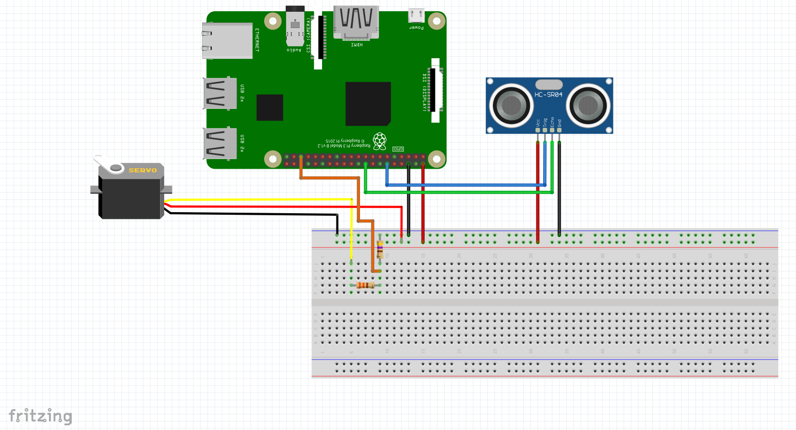

# sonar

*| sonar from a HC-SR04 sensor (ultrasonic sensor) with a raspberry |*

## materials
### electronics
- raspberry
- screen (to support pygame UI output)
- wires
- HC-SR04 sensor
- servo motor
### support
You can build the support with laser-cut mdf (like us) or with 3D printing.
All files in the folder `files`.
### connections

Just note that :
- servo `pulse` goes to GPIO25
- HC-SR04 `trigger` goes to GPIO18
- HC-SR04 `echo` goes to GPIO24

Of course those are just the default values in the script, edit them at will.
## Concept
The idea behind this project is to have a radar render of items detected by the ultrasonic sensor through a servo motor
moving from 0 to 180 degrees.
## Code
## Sources
- Sonar Logo : sonar by Ian [Rahmadi Kurniawan](https://thenounproject.com/irk.aminin/) from the Noun Project
- Servo motor control : [https://raspberry-pi.fr](https://raspberry-pi.fr/servomoteur-raspberry-pi)
- HC-SR04 control : [https://raspberrypi-tutorials.fr](https://raspberrypi-tutorials.fr/utilisation-dun-capteur-de-distance-raspberry-pi-capteur-ultrasonique-hc-sr04/)